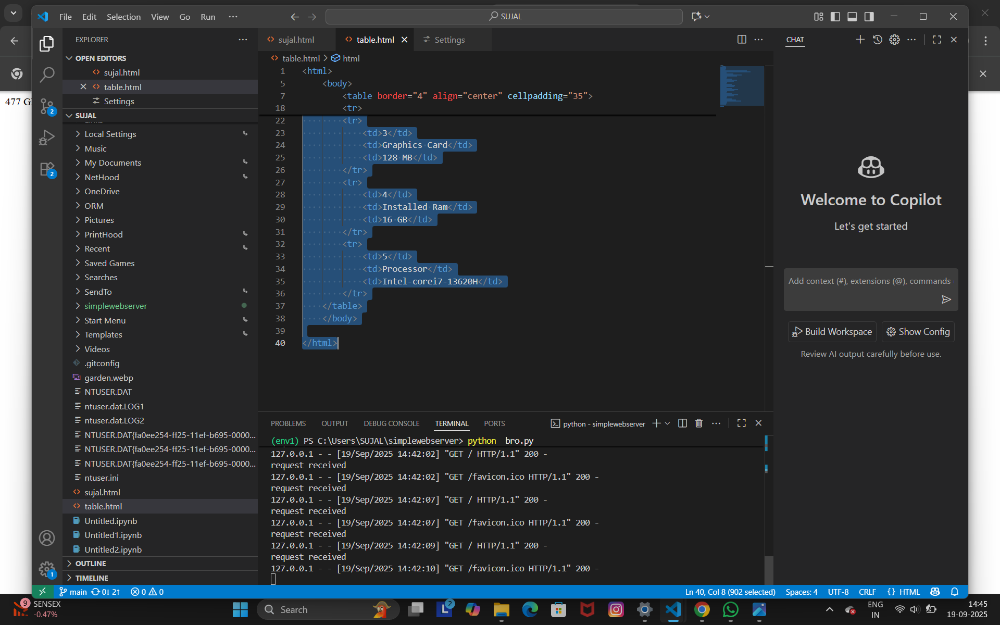

# EX01 Developing a Simple Webserver
## Date:
05.09.2025
## AIM:
To develop a simple webserver to serve html pages and display the Device Specifications of your Laptop.

## DESIGN STEPS:
### Step 1: 
HTML content creation.

### Step 2:
Design of webserver workflow.

### Step 3:
Implementation using Python code.

### Step 4:
Import the necessary modules.

### Step 5:
Define a custom request handler.

### Step 6:
Start an HTTP server on a specific port.

### Step 7:
Run the Python script to serve web pages.

### Step 8:
Serve the HTML pages.

### Step 9:
Start the server script and check for errors.

### Step 10:
Open a browser and navigate to http://127.0.0.1:8000 (or the assigned port).

## PROGRAM:
```
from http.server import HTTPServer, BaseHTTPRequestHandler
content = """
<!DOCTYPE html>
<html>
 <head>
      table
    </head>
    <body>
        <h1 align="center">SUJAL DAS-25013553 </h1>
        <table border="4" align="center" cellpadding="35">
        <tr>
            <th>S.NO</th>
            <th>DEVICE SPECIFICATION</th>
            <th>DESCRIPTION</th>
        </tr>
        <tr>
            <td>1</td>
            <td>Device Name</td>
            <td>SUJAL</td>
        </tr>
        <tr>
            <td>2</td>
            <td>Storage</td>
            <td>477 GB</td>
         </tr>   
        <tr>
            <td>3</td>
            <td>Graphics Card</td>
            <td>128 MB</td>
        </tr>
        <tr>
            <td>4</td>
            <td>Installed Ram</td>
            <td>16 GB</td>
        </tr>
        <tr>
            <td>5</td>
            <td>Processor</td>
            <td>Intel-corei7-13620H</td>
        </tr>
    </table>
    </body>


</html>
"""
class myhandler(BaseHTTPRequestHandler):
    def do_GET(self):
        print("request received")
        self.send_response(200)
        self.send_header('content-type', 'text/html; charset=utf-8')
        self.end_headers()
        self.wfile.write(content.encode())
server_address = ('',8000)
httpd = HTTPServer(server_address,myhandler)
print("my webserver is running...")
httpd.serve_forever()

```

## OUTPUT:



## RESULT:
The program for implementing simple webserver is executed successfully.
